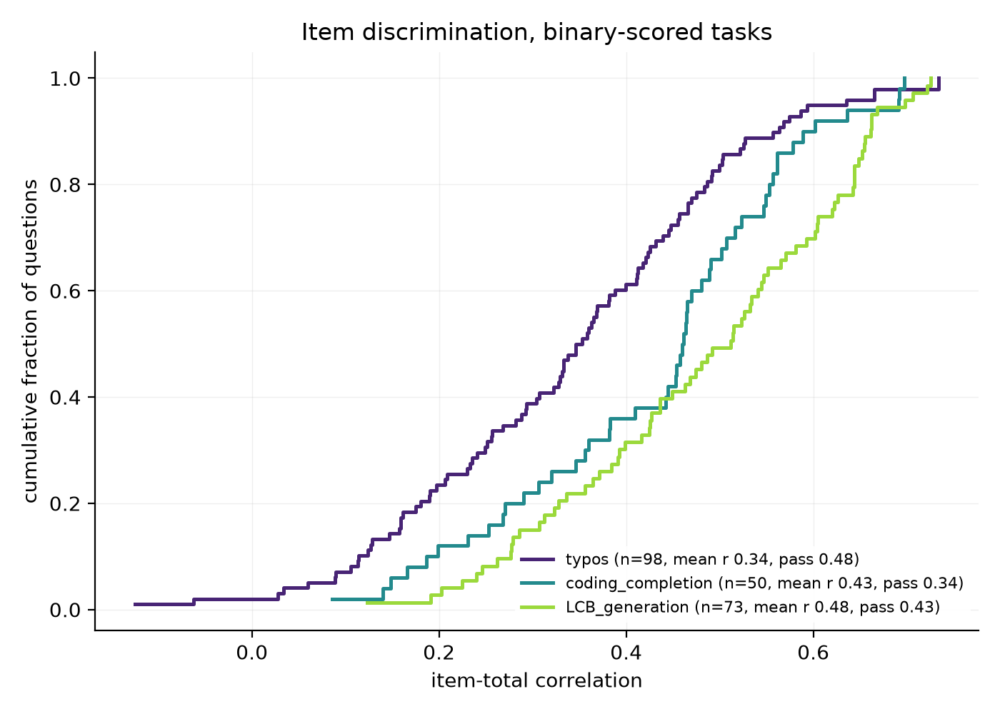

# livebench-irt

A measurement model for [LiveBench](https://livebench.ai/).

LiveBench ranks language models by average score. This repository fits an item
response theory (IRT) model to the same per-question judgments and asks what
the average score cannot answer: how precisely does the benchmark measure, how
much of the published ordering is real, and which questions are carrying signal.

The short version of what came out: **the benchmark measures precisely, the
leaderboard ordering is much coarser than it looks, and how a task is scored
matters more for question quality than how well the question was written.**

## Data

[`livebench/model_judgment`](https://huggingface.co/datasets/livebench/model_judgment)
on Hugging Face — one row per (question, model, turn) with an objective score in
[0, 1]. The snapshot used here covers **195 models and 494 questions across three
categories** (coding, instruction_following, language), 67.3% of cells observed.
After dropping models and questions with too few observations to estimate
anything from, the analysis matrix is 178 × 494.

This is a historical snapshot: of the 394 questions whose metadata is still
retrievable, **294 have since been retired** by LiveBench. Every result below is
about that snapshot, not about the current leaderboard.

## The model

For model $j$ and question $i$:

$$P(\text{correct}) = \sigma\big(a_i(\theta_j - b_i)\big)$$

$\theta_j$ is ability — the quantity a leaderboard is trying to report. $b_i$ is
difficulty, $a_i$ discrimination. Fitted by joint maximum likelihood with ridge
penalties, identified by standardising $\theta$ over the models whose ability is
estimable. Scores are fractional, so the Bernoulli log-likelihood is evaluated at
fractional outcomes — a quasi-likelihood approximation, discussed under
Limitations.

## Findings

### 1. Measurement noise is about one sixth of the spread between models

Ability has standard deviation 1 by construction; bootstrapping over questions
gives a standard error of **0.167** per model. So the benchmark itself is
precise — a reliability around 0.97.

But 178 models are packed into roughly six standard errors of each other, and
the consequence is that **the median model's rank moves by 20 places** under
resampling (IQR 14–25, max 62). Ranks 30 and 45 are not distinguishable.

These two statements are not in tension, and keeping them apart is the point:
the benchmark measures well, while presenting the result as a 1-to-178 ordered
list discards most of what it knows.

The intervals are not an artefact of the iteration cap used for speed:
`scripts/03_check_convergence.py` gets 0.167 at `maxiter=300` against 0.172 at
`maxiter=2000`, a 3% difference.

### 2. Most "low-discrimination" questions are not evidence of anything

Flagging questions by a fixed cutoff on the 2PL discrimination `a_i` does not
work, because `a_i` is not comparable across fits. Changing the ability prior
from `theta_ridge=0` to `0.5` moved the median `a` by 1.8% but moved the
smallest value by 31% (0.051 → 0.035) and reordered the bottom of the list. The
reported count of bad questions went from 5 to 8 for reasons that had nothing to
do with the questions.

The replacement is the item-total correlation, which lives in [-1, 1] by
construction and does not move when ability is rescaled (measured change under
an affine rescaling of $\theta$: 4.4 × 10⁻¹⁶), together with a bootstrap
interval over the model panel. A question is called uninformative only if the
**upper** end of its interval fails to clear the threshold.

Result: **14 questions confidently uninformative, 35 more whose intervals rule
nothing out.** Only about a third of suspicious-looking questions survive
contact with an error bar. No question has a confidently negative correlation,
so there are no reversed questions in this snapshot.

### 3. Discrimination shifts with the scoring format, not with question quality

Among binary-scored tasks, the whole distribution of item discrimination moves:

| task | n | mean *r* | sd | pass rate |
|---|---|---|---|---|
| typos (exact match) | 98 | 0.341 | 0.172 | 0.475 |
| coding_completion | 50 | 0.429 | 0.151 | 0.344 |
| LCB_generation (test cases) | 73 | 0.483 | 0.151 | 0.427 |



Kruskal-Wallis H = 28.6, p = 6.3 × 10⁻⁷. Pairwise with Holm correction: typos
vs LCB_generation, gap −0.142, p < 0.0001; typos vs coding_completion, gap
−0.088, p = 0.0046. (coding_completion vs LCB_generation, p = 0.058 — same
direction, not significant.)

**The attenuation objection does not apply.** Point-biserial correlation is
attenuated as the pass rate moves away from 0.5, so a sceptic should ask whether
this ordering is just the pass-rate ordering. It is the reverse: `typos` sits
closest to 0.5, where attenuation is weakest, and is still the worst. See
`figures/task_discrimination_binary.png`, which carries the pass rates in the
legend for exactly this reason.

This is a distributional shift, not a handful of duds. The `typos` deciles climb
smoothly (−0.13, 0.12, 0.18, 0.25, 0.31, 0.35, 0.39, 0.44, 0.49, 0.56, 0.73)
with no second mode. `typos` also has the highest dispersion of any task, so its
signal is both weaker and less stable.

The one continuous-scored task, `plot_unscrambling`, has the highest
discrimination of all (0.574). Suggestive of finer scoring retaining more
information, but not comparable to the binary tasks, so it is not offered as
evidence.

## What did not survive

Four earlier findings were discarded after checking. They are listed because the
checks are part of the result:

- **"Low discrimination predicts LiveBench's own retirements."** 294 of 394
  questions had already been retired — a 75% base rate, under which flagging 4
  questions and having all 4 retired happens 32% of the time by chance.
- **"Models that answer fewer questions get wider rank intervals."** r = −0.285,
  quartile means not monotone, and a counterexample in the second row of the
  leaderboard.
- **"Partial credit distorts the ability scale nonlinearly."** The Pearson
  correlation was wrecked by a single divergent point (see Separation below);
  the Spearman correlation was 0.993 throughout.
- **"`typos` questions fail because the texts are long."** Flagged questions
  averaged 1070 characters against 1095 unflagged, p = 0.66. Neither the number
  of corrections (p = 0.77), the number of word-boundary errors (p = 0.24), nor
  the share of ambiguous corrections (p = 1.00) separates them either
  (`scripts/04_typos_mechanism.py`).

So the mechanism behind finding 3 is **not identified**. What is established is
that it is not a property of individual questions: flagged and unflagged `typos`
questions are indistinguishable on every text feature measured.

## Limitations

- **Joint MLE is inconsistent in the item parameters.** Each question's
  parameters are estimated from as many observations as there are models — the
  classic incidental-parameters setting. Simulated recovery of difficulty: 0.81
  at 60 models, 0.94 at 120, 0.96 at 300. With 178 models this is tolerable but
  not clean; marginal MLE is the correct fix.
- **Unidimensionality is assumed and is likely wrong.** Coding and language
  ability are not one latent trait. Per-task fits are a crude check; a
  multidimensional model is the honest version.
- **Fractional scores are handled by quasi-likelihood.** 453 distinct score
  values appear in the data. Three tasks are strictly binary, three are
  few-level ordinal, one is continuous. The correct tools are a generalised
  partial credit model and a beta response model respectively; neither is
  implemented.
- **Local independence is assumed.** Questions drawn from the same source
  article are not independent given ability.
- **Text is recoverable for only half the `typos` questions** (50 of 100) — the
  rest were retired and are no longer distributed. Flagging rates in the two
  halves are 26% and 20% (Fisher p = 0.64), so no selection bias is detectable,
  though n = 50 has little power to detect one.
- **Three of six categories.** math, reasoning and data_analysis are absent from
  this snapshot.

## Separation

A model scoring zero on everything it attempted has no finite maximum likelihood
estimate of ability. Unguarded, the optimiser walks toward negative infinity and
returns wherever it stopped — a number that looks like an estimate but is not.
In this data, `mistral-large` (100 questions, mean score 0.019) hits this after
binarisation and lands at θ = −11.49, and because abilities are standardised,
that single point compresses every other model's ability toward zero.

The fix is a N(0, 1) prior on ability, an explicit separation flag, and excluding
separated models from the standardisation. On simulated data with three planted
separated models this restores the other 87 to a correct mean 0, sd 1 scale; on
synthetic checks the prior costs nothing in recovery (r = 0.9920 either way).

## Quickstart

```bash
git clone https://github.com/Willexi8/livebench-irt.git
cd livebench-irt
python -m venv .venv && source .venv/Scripts/activate   # bin/activate on Unix
pip install -r requirements.txt

python tests/test_irt.py
python tests/test_diagnostics.py

python scripts/00_smoke_test.py     # synthetic data with known parameters
python scripts/02_fit_irt.py        # verify the pipeline before the real download
```

Then delete `data/model_judgment.parquet` and run against the real thing:

```bash
python scripts/01_download.py
python scripts/02_fit_irt.py             # ability, intervals, item diagnostics
python scripts/03_check_convergence.py   # are the intervals convergence-stable
python scripts/04_typos_mechanism.py     # text features of flagged questions
python scripts/05_task_discrimination.py # discrimination by task
```

`02_fit_irt.py` takes a few minutes: 200 bootstrap refits with no progress
output. It is working.

## Layout

```
src/livebench_irt/
    irt.py           2PL fit, bootstrap, rank confidence sets, separation
    diagnostics.py   item-total correlation with bootstrap intervals
    load.py          download, cache, reshape into a score matrix
    plots.py         leaderboard with error bars, difficulty-discrimination map
scripts/             00 smoke test, 01 download, 02 main, 03-05 as above
tests/               parameter recovery, separation, scale invariance
```

## Status

Work in progress. Test equating across monthly question rotations — the obvious
next question for a benchmark that replaces its questions to resist
contamination — is not implemented.
